# E-Commerce Sales & Customer Analytics with AI

> A complete, end-to-end data analytics project — from raw CSV files to an interactive full-stack web dashboard — built on the real-world Brazilian E-Commerce dataset published by Olist.

**Author:** YOUR NAME  |  **Program:** AICTE – IBM SkillsBuild Data Analytics with AI Internship 2026  |  **Dataset:** [Kaggle – Olist Brazilian E-Commerce](https://www.kaggle.com/datasets/olistbr/brazilian-ecommerce)

> **Note on data files:** the raw and cleaned CSV files are not stored in this repository because of their size. Download the dataset from Kaggle and place the 9 CSVs in `data/raw/` (or the project root), then follow the setup steps below to regenerate everything.

---

## Table of Contents

1. [Problem Statement](#problem-statement)
2. [Dataset](#dataset)
3. [Project Phases](#project-phases)
4. [Key Insights & KPIs](#key-insights--kpis)
5. [Technology Stack](#technology-stack)
6. [Project Structure](#project-structure)
7. [Setup & Installation](#setup--installation)
8. [Running the Application](#running-the-application)
9. [API Reference](#api-reference)
10. [Dashboard Pages](#dashboard-pages)
11. [Screenshots](#screenshots)
12. [Design Decisions](#design-decisions)

---

## Problem Statement

Brazilian e-commerce grew rapidly between 2016 and 2018. Olist, a marketplace that connects small retailers to major Brazilian commerce channels, accumulated transaction data across tens of thousands of orders.

**The analytical challenge:** this raw data exists across nine separate CSV files with no unified view, no derived metrics, and no way for a non-technical stakeholder to explore it. Sales managers, operations teams, and product analysts cannot answer basic questions like:

- Which product categories generate the most revenue?
- What percentage of orders are delivered late, and has that improved?
- Which customers are most valuable, and which are at risk of churning?
- Is monthly revenue growing or plateauing?
- Are there orders that look statistically unusual and warrant closer review?

**This project solves that problem** by building a full analytics pipeline — data cleaning, SQL database, machine-learning models, and a live web dashboard — on top of the Olist dataset, making every question above answerable in seconds.

---

## Dataset

**Source:** [Brazilian E-Commerce Public Dataset by Olist](https://www.kaggle.com/datasets/olistbr/brazilian-ecommerce) — Kaggle

The dataset covers approximately **100,000 orders** placed on the Olist marketplace between **September 2016 and August 2018**, across all major Brazilian states.

| File | Rows | Description |
|------|-----:|-------------|
| `olist_orders_dataset.csv` | 99,441 | Order lifecycle — status, timestamps, customer reference |
| `olist_order_items_dataset.csv` | 112,650 | Line items — product, seller, price, freight per order |
| `olist_order_payments_dataset.csv` | 103,886 | Payment method, number of instalments, value |
| `olist_order_reviews_dataset.csv` | ~100,000 | Customer review score (1–5) and optional comment |
| `olist_customers_dataset.csv` | 99,441 | Customer location — city, state, zip prefix |
| `olist_sellers_dataset.csv` | 3,095 | Seller location data |
| `olist_products_dataset.csv` | 32,951 | Product metadata — category, dimensions, weight |
| `olist_geolocation_dataset.csv` | 1,000,163 | ZIP code → latitude/longitude mapping |
| `product_category_name_translation.csv` | 71 | Portuguese category names → English |

> **The original CSV files are never modified.** All cleaning and transformation outputs are written to `data/cleaned/`.

---

## Project Phases

The project is structured as 13 sequential phases, each building on the previous:

| # | Phase | Key Output |
|---|-------|-----------|
| 1 | Dataset Understanding | `reports/data_dictionary.md` — schema, nulls, quirks |
| 2 | Data Cleaning | 10 cleaned CSVs in `data/cleaned/` |
| 3 | Data Preprocessing | 6 analytical CSVs — RFM features, monthly sales, order totals |
| 4 | Exploratory Data Analysis | 23 charts saved to `reports/figures/` |
| 5 | SQL Database Creation | `sql/schema.sql` — 7-table MySQL schema with FK constraints |
| 6 | SQL Business Analysis | 3 query files covering 15+ business questions |
| 7 | Power BI Learning Module | `powerbi/powerbi_guide.md`, DAX measures (offline, not a web dep) |
| 8 | Customer Segmentation | K-Means (K=4) RFM clustering → `data/cleaned/customer_segments.csv` |
| 9 | Sales Forecasting | Polynomial regression + Exp. Smoothing → `data/cleaned/forecast_results.csv` |
| 10 | Anomaly Detection | IQR + Isolation Forest → `data/cleaned/anomalies.csv` |
| 11 | AI Business Insights | Rule-based NL report → `reports/ai_insights_report.json` / `.txt` |
| 12 | FastAPI Backend | 12 REST endpoints serving all analytical outputs |
| 13 | React Frontend | 9-page interactive dashboard with Plotly charts |

---

## Key Insights & KPIs

All figures below are derived directly from the Olist dataset (Phases 2–11). No values are estimated or extrapolated.

### Headline KPIs (delivered orders, Sep 2016 – Aug 2018)

| KPI | Value |
|-----|-------|
| Total delivered orders | 96,478 |
| Unique customers | 93,358 |
| Total revenue | R$ 15.42 M |
| Average order value | R$ 159.86 |
| Median order value | R$ 105.28 |
| Average review score | 4.09 / 5.0 |
| 5-star review rate | 57.8% |
| Late delivery rate | 8.0% |
| Average delivery time | 12.6 days |
| Credit card payment share | 73.9% |

### Sales Trends

- Revenue peaked in **November 2017 at R$ 1.15 M**, compared to a dataset average of R$ 734 K/month.
- Strong upward growth through 2017, followed by a relative plateau in early 2018.
- Polynomial regression forecast (3-month horizon): **R$ 1.36 M → R$ 1.40 M → R$ 1.43 M** (MAPE 18.2% on test set — treat as directional, not precise).

### Top Product Categories by Revenue

| Rank | Category | Revenue |
|------|----------|--------:|
| 1 | health_beauty | R$ 1.26 M |
| 2 | watches_gifts | R$ 1.21 M |
| 3 | bed_bath_table | R$ 1.04 M |
| 4 | sports_leisure | R$ 988 K |
| 5 | computers_accessories | R$ 912 K |

### Customer Segments (K-Means RFM, K=4)

| Segment | Customers | Share | Avg Spend |
|---------|----------:|------:|----------:|
| Recent Light Buyers | 35,751 | 38.3% | R$ 69.52 |
| High-Value Champions | 27,589 | 29.6% | R$ 320.52 |
| Inactive Low-Spend | 27,217 | 29.2% | R$ 118.67 |
| Loyal Regulars | 2,801 | 3.0% | R$ 308.59 |

> Segment labels describe observed purchasing behaviour (recency, frequency, monetary value) only. They do not imply any claim about customer intent or demographics.

### Notable Findings

- **97% of customers placed only one order** during the observation period — nearly all revenue comes from first-time buyers, not repeat purchasers.
- **Shipping costs average 16.6%** of the item price — a meaningful addition to total customer cost.
- **Estimated delivery dates are conservative** — orders typically arrived ~11 days before the communicated estimate.
- **26,408 orders were flagged as statistically unusual** by IQR or Isolation Forest. These are not labelled as problematic; domain review is required.

---

## Technology Stack

| Layer | Technology | Purpose |
|-------|-----------|---------|
| Language | Python 3.x | Data pipeline, ML, backend |
| Data manipulation | Pandas, NumPy | Cleaning, preprocessing, feature engineering |
| Visualisation (EDA) | Matplotlib, Seaborn | Offline chart generation |
| Machine Learning | Scikit-learn | K-Means segmentation, Isolation Forest, regression |
| Database | MySQL 8.x | Persistent storage, SQL business analysis |
| ORM | SQLAlchemy 2.x | Database connection, query execution |
| Backend framework | FastAPI | REST API — 12 endpoints, auto Swagger docs |
| API validation | Pydantic | Request/response schema validation |
| Environment config | python-dotenv | Credential management — no hardcoded passwords |
| Frontend framework | React 18 + Vite | Single-page application |
| Charts | Plotly.js / react-plotly.js | Interactive charts in the browser |
| HTTP client | Axios | Frontend → backend communication |
| Styling | Plain CSS | No external UI library |
| BI (offline) | Power BI Desktop | Separate learning module — not a web dependency |

---

## Project Structure

```
project-root/
│
├── data/
│   ├── raw/                        # Copies of the 9 original Olist CSVs — never modify
│   └── cleaned/                    # All pipeline outputs
│       ├── customers_clean.csv
│       ├── orders_clean.csv
│       ├── orders_enriched.csv     # + engineered delivery metrics
│       ├── order_items_clean.csv
│       ├── order_payments_clean.csv
│       ├── order_reviews_clean.csv
│       ├── products_clean.csv
│       ├── sellers_clean.csv
│       ├── geolocation_aggregated.csv  # 19K rows — safe to load (raw = 1M)
│       ├── monthly_sales.csv
│       ├── customer_features.csv   # RFM inputs
│       ├── customer_segments.csv   # K-Means output
│       ├── forecast_results.csv    # Model predictions
│       └── anomalies.csv           # Flagged orders
│
├── python/                         # Analytics scripts (all run from project root)
│   ├── data_cleaning.py
│   ├── preprocessing.py
│   ├── eda.py
│   ├── customer_segmentation.py
│   ├── forecasting.py
│   ├── anomaly_detection.py
│   ├── ai_insights.py
│   └── db_seed.py                  # Loads cleaned CSVs into MySQL
│
├── sql/
│   ├── schema.sql                  # CREATE TABLE statements (7 tables)
│   ├── load_data.sql
│   ├── basic_analysis.sql
│   ├── intermediate_analysis.sql
│   └── advanced_analysis.sql
│
├── backend/
│   ├── main.py                     # FastAPI app entry point
│   ├── database.py                 # SQLAlchemy engine — uses URL.create() for safe auth
│   ├── .env.example                # Copy to .env and fill in DB_PASSWORD
│   ├── requirements.txt
│   ├── models/orm_models.py        # SQLAlchemy ORM models
│   ├── schemas/response_schemas.py # Pydantic response models
│   ├── services/data_service.py    # All queries and CSV access
│   └── routers/                    # One file per endpoint group
│
├── frontend/
│   ├── package.json
│   ├── vite.config.js              # /api proxy → localhost:8000
│   └── src/
│       ├── api/
│       │   ├── client.js           # Axios instance + named API functions
│       │   └── useApiData.js       # Custom hook — replaces useState+useEffect boilerplate
│       ├── components/             # KpiCard, ChartCard, PlotlyChart, LoadingSpinner, ErrorMessage
│       └── pages/                  # Dashboard, Sales, Customers, Products, Delivery,
│                                   # Segmentation, Forecast, Anomalies, AIInsights
│
├── powerbi/
│   ├── powerbi_guide.md            # Step-by-step Power BI connection and report guide
│   └── dax_measures.dax            # Ready-to-paste DAX measure definitions
│
├── reports/
│   ├── data_dictionary.md
│   ├── ai_insights_report.txt
│   ├── ai_insights_report.json
│   └── figures/                    # 23 EDA charts (PNG)
│
├── docs/
│   └── screenshots/                # Charts used in this README
│
├── AGENTS.md                       # AI assistant guidance for this repository
└── README.md
```

---

## Setup & Installation

### Prerequisites

| Requirement | Minimum version |
|-------------|----------------|
| Python | 3.9+ |
| Node.js | 18+ |
| MySQL | 8.0+ |
| pip | latest |

### Step 1 — Clone the repository

```bash
git clone https://github.com/YOUR_USERNAME/ecommerce-sales-customer-analytics-ai.git
cd ecommerce-sales-customer-analytics-ai
```

### Step 2 — Create and activate a virtual environment

**Windows:**
```bash
python -m venv venv
venv\Scripts\activate
```

**macOS / Linux:**
```bash
python -m venv venv
source venv/bin/activate
```

### Step 3 — Install Python dependencies

```bash
pip install -r backend/requirements.txt
pip install pandas numpy matplotlib seaborn scikit-learn statsmodels python-dotenv
```

Or install everything in one step:

```bash
pip install fastapi uvicorn[standard] sqlalchemy pymysql python-dotenv \
            pandas numpy matplotlib seaborn scikit-learn statsmodels pydantic
```

### Step 4 — Configure the database credentials

```bash
copy backend\.env.example backend\.env      # Windows
# cp backend/.env.example backend/.env      # macOS / Linux
```

Open `backend/.env` and set your MySQL root password:

```
DB_HOST=localhost
DB_PORT=3306
DB_USER=root
DB_PASSWORD=your_mysql_password
DB_NAME=olist_ecommerce
CLEANED_DATA_DIR=../data/cleaned
REPORTS_DIR=../reports
```

> Passwords containing special characters (such as `@`) are handled safely — the connection uses `SQLAlchemy URL.create()` which percent-encodes them automatically.

### Step 5 — Run the data pipeline (one-time)

Run all scripts from the **project root** in this order:

```bash
python python/data_cleaning.py
python python/preprocessing.py
python python/eda.py
python python/customer_segmentation.py
python python/forecasting.py
python python/anomaly_detection.py
python python/ai_insights.py
```

Each script prints progress and confirms its output files.

### Step 6 — Create the MySQL database schema

In MySQL Workbench, MySQL Shell, or a terminal:

```bash
mysql -u root -p < sql/schema.sql
```

This creates the `olist_ecommerce` database and all 7 tables. It does not load any data.

Verify:
```bash
mysql -u root -p -e "USE olist_ecommerce; SHOW TABLES;"
```

### Step 7 — Seed the database

```bash
python python/db_seed.py
```

This reads credentials from `backend/.env` and loads all 7 tables in foreign-key order:

```
customers → products → sellers → orders → order_items → payments → reviews
```

Expected output:
```
Connecting to MySQL ...
  Connected. MySQL version: 8.x.xx

Loading tables in FK dependency order ...
  Loading customers (99,441 rows) ... done.
  Loading products  (32,951 rows) ... done.
  Loading sellers   ( 3,095 rows) ... done.
  Loading orders    (99,441 rows) ... done.
  Loading order_items (112,650 rows) ... done.
  Loading payments  (103,886 rows) ... done.
  Loading reviews   ( 98,673 rows) ... done.

Verification -- row counts per table:
  customers        99,441  OK
  products         32,951  OK
  sellers           3,095  OK
  orders           99,441  OK
  order_items     112,650  OK
  payments        103,886  OK
  reviews          98,673  OK

Database seeding complete.
```

### Step 8 — Install frontend dependencies

```bash
cd frontend
npm install
```

---

## Running the Application

### Start the FastAPI backend

Run from the **project root** (not from inside `backend/`):

```bash
uvicorn backend.main:app --reload --port 8000
```

| URL | Description |
|-----|-------------|
| `http://localhost:8000/` | API welcome message |
| `http://localhost:8000/api/health` | Health check — confirms DB connection status |
| `http://localhost:8000/docs` | Interactive Swagger UI — all 12 endpoints |
| `http://localhost:8000/redoc` | ReDoc documentation |

### Start the React frontend

In a second terminal:

```bash
cd frontend
npm run dev
```

Open **http://localhost:5173** in your browser.

> The Vite dev server proxies all `/api/*` requests to `localhost:8000`, so no CORS configuration is required.

### CSV fallback (no database required)

Six of the twelve endpoints (`/api/health`, `/api/sales/monthly`, `/api/segmentation`, `/api/forecast`, `/api/anomalies`, `/api/insights`) read directly from the cleaned CSV files. These work even without a MySQL connection, making it possible to view and test most of the dashboard without completing the database setup.

---

## API Reference

| Method | Endpoint | Requires DB | Description |
|--------|----------|:-----------:|-------------|
| GET | `/api/health` | No | Service health check — reports DB connection status |
| GET | `/api/dashboard/kpis` | Yes | Nine headline KPI metrics |
| GET | `/api/sales/monthly` | No | 21 months of revenue and order-count data |
| GET | `/api/products/categories?limit=N` | Yes | Top N categories by revenue (default 20, max 73) |
| GET | `/api/customers/stats` | Yes | Repeat rate, spend distribution, breakdown by state |
| GET | `/api/payments/analysis` | Yes | Payment type share, instalment distribution |
| GET | `/api/reviews/analysis` | Yes | Score distribution, 5-star rate, negative rate |
| GET | `/api/delivery/analysis` | Yes | Monthly avg delivery days and late-delivery rate |
| GET | `/api/segmentation` | No | Four RFM K-Means segments with per-segment stats |
| GET | `/api/forecast` | No | Historical actuals + polynomial model fit + 3-month forecast |
| GET | `/api/anomalies?limit=N` | No | Top N statistically unusual orders (default 50) |
| GET | `/api/insights` | No | Full AI business insights report (JSON) |

Full interactive documentation: **http://localhost:8000/docs**

---

## Dashboard Pages

| Page | Route | What it shows |
|------|-------|---------------|
| Dashboard | `/` | Nine KPI cards, monthly revenue and order-count charts |
| Sales Analytics | `/sales` | Monthly revenue trend, AOV, review score and delivery overlay |
| Customer Analytics | `/customers` | Repeat rate, spend distribution, top states by orders and revenue |
| Product Analytics | `/products` | Revenue, order count, and review score per category (adjustable top-N) |
| Delivery & Reviews | `/delivery` | Delivery time trend, late rate by month, review distribution, payment share |
| Customer Segmentation | `/segmentation` | Segment size, spend, recency, and frequency charts; detailed table |
| Sales Forecast | `/forecast` | Actual vs predicted chart, train/test split marker, 3-month forward projection |
| Anomaly Detection | `/anomalies` | Payment-value boxplot, Isolation Forest score histogram, flagged order table |
| AI Insights | `/insights` | Executive summary, key trends, product/customer/delivery/review insights |

---

## Screenshots

### Web Application

**React Dashboard — Sales Analytics page** (`http://localhost:5173/sales`)

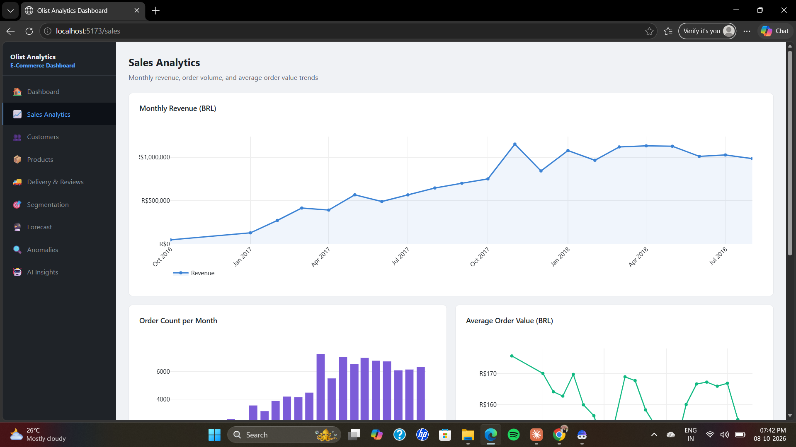

**FastAPI Interactive Documentation — Swagger UI** (`http://localhost:8000/docs`)

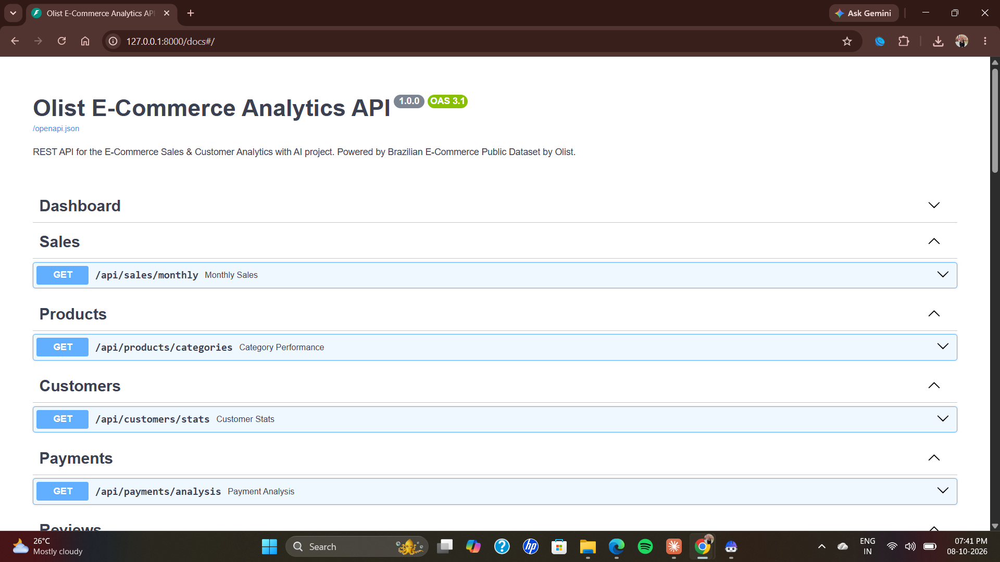

### Analytics Charts

All figures below are generated by the analytics pipeline (`python/eda.py`, `forecasting.py`, `anomaly_detection.py`) and are also stored in `reports/figures/`.

### 1. Business Overview

**Key Performance Indicators**

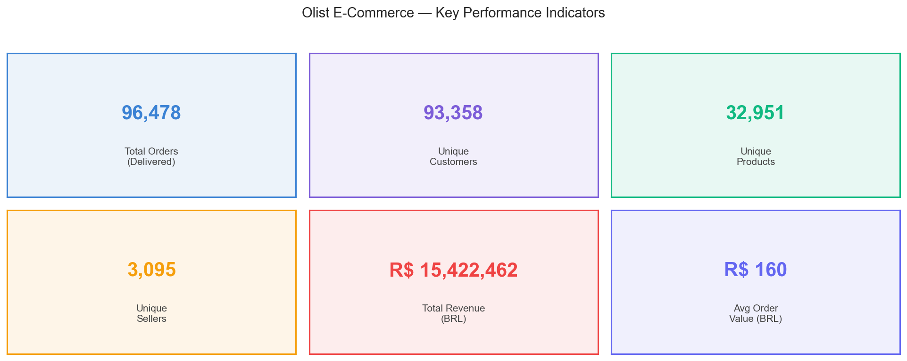

**Monthly Revenue** (peak in November 2017 at R$ 1.15 M)

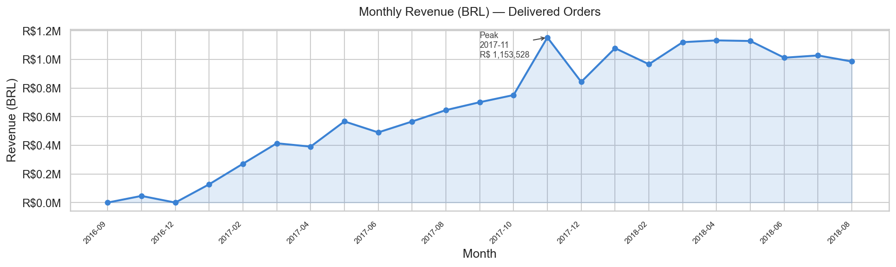

**Monthly Orders**

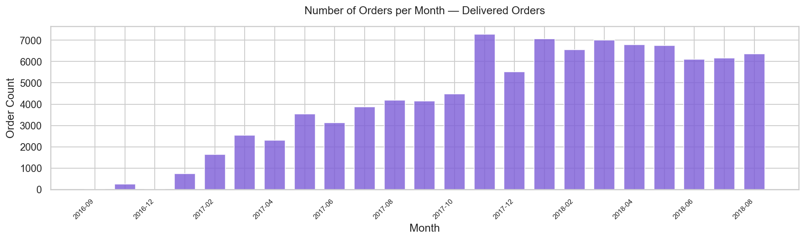

### 2. Products & Payments

**Top 15 Categories by Revenue**

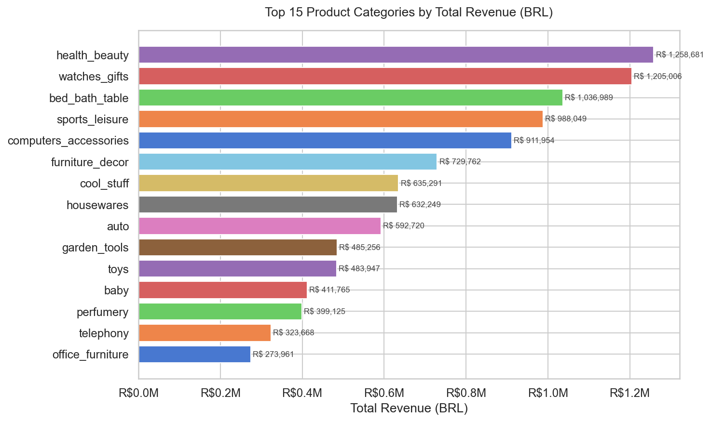

**Top 15 Categories by Orders**

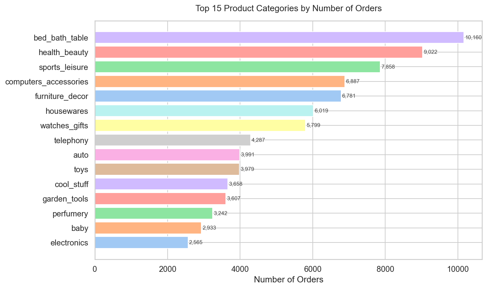

**Payment Analysis**

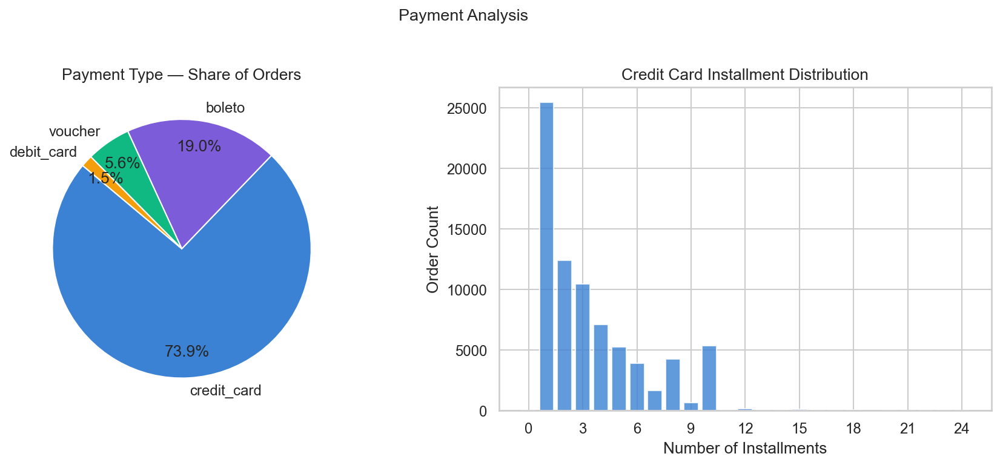

### 3. Customers, Reviews & Delivery

**Review Score Distribution**

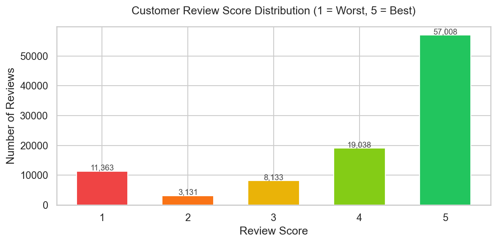

**Delivery Time Analysis**

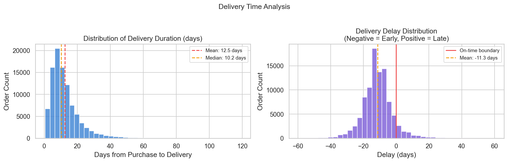

**Order Value Analysis**

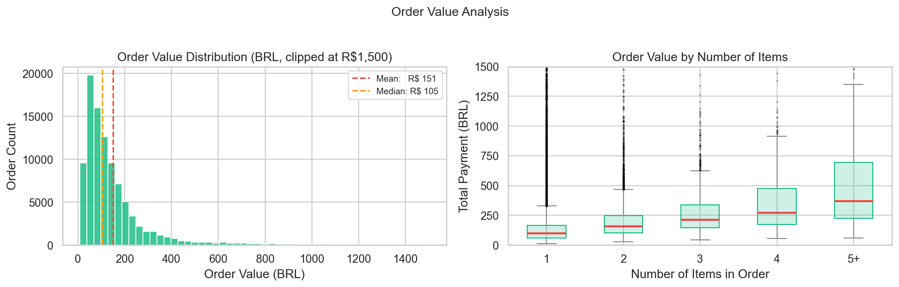

**Customer Purchase Behaviour**

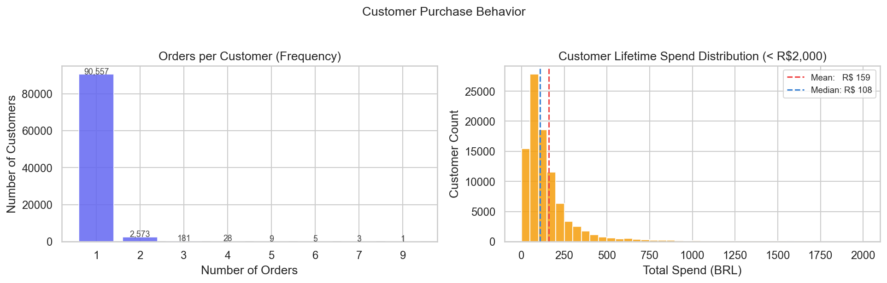

**When Customers Shop**

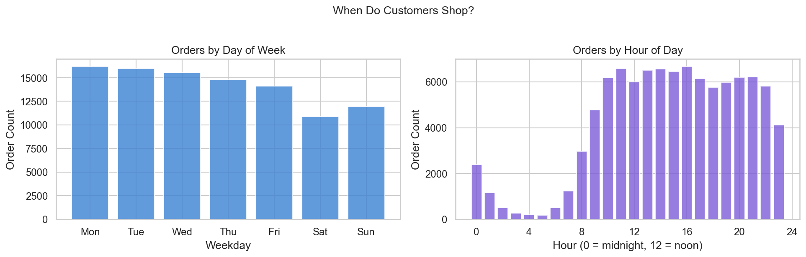

**Geography — Orders and Revenue by State**

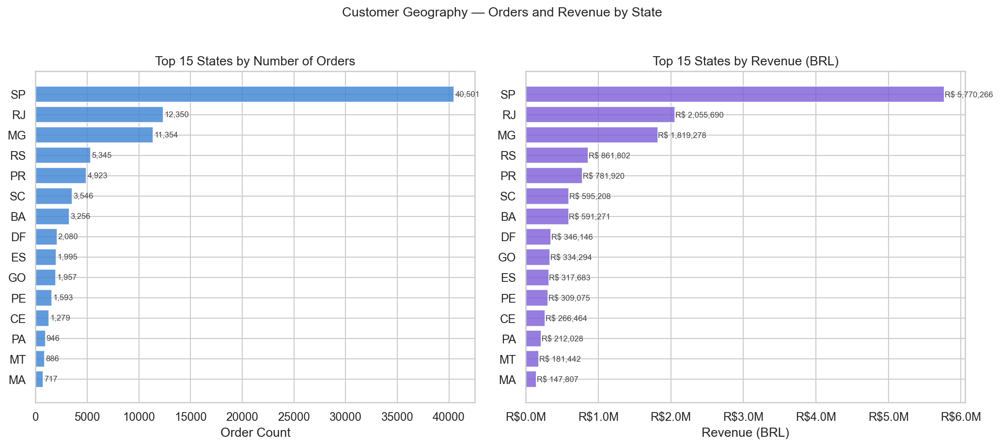

**Correlation Matrix**

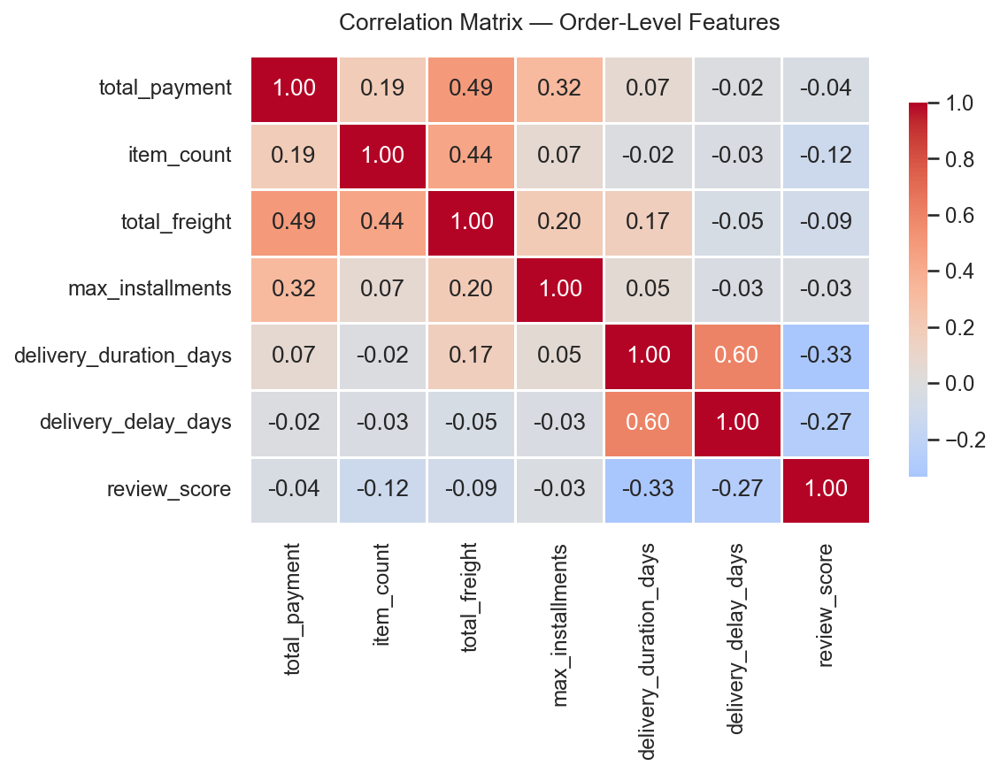

### 4. Sales Forecasting

**Actual vs Predicted Revenue** (Linear, Polynomial, 3-month forecast)

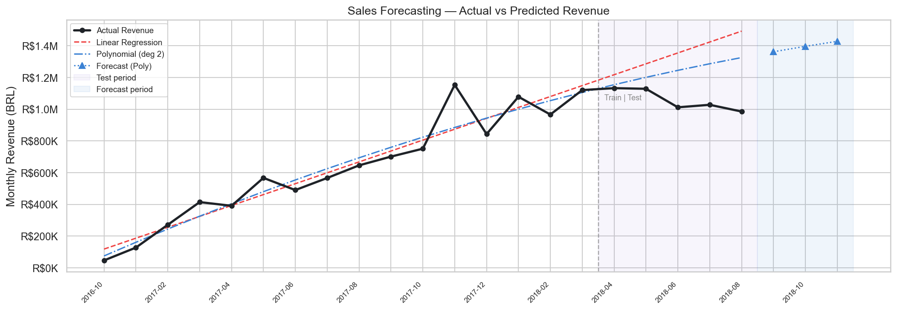

**Forecast Residuals**

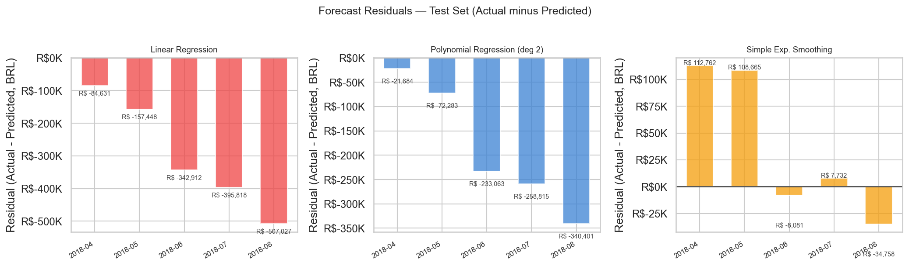

### 5. Anomaly Detection

**Order-Level Anomalies** (flagged by both IQR and Isolation Forest)

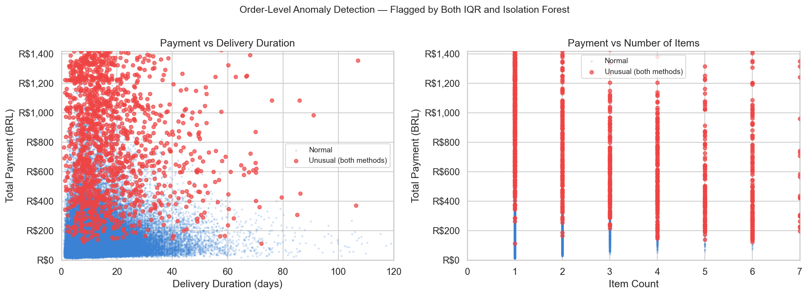

**Unusual Months**

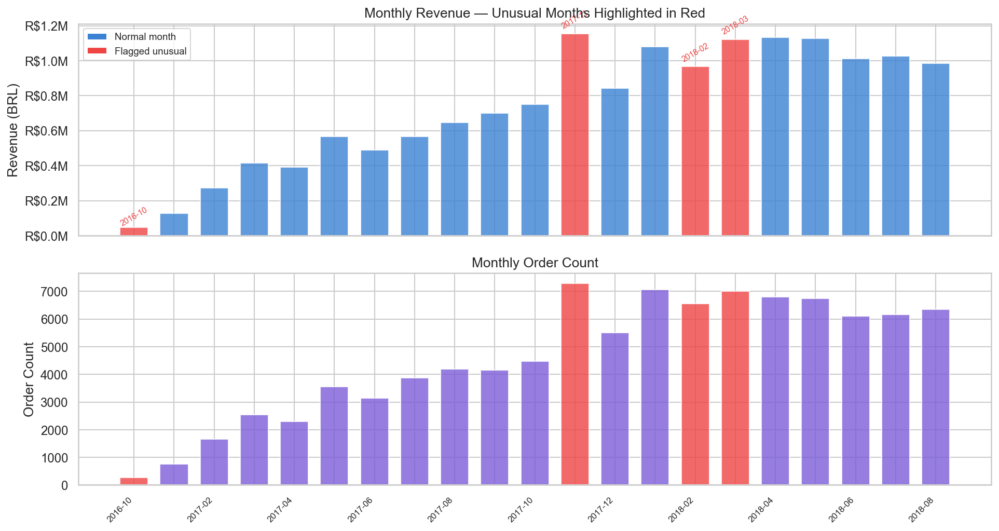

**Feature Distributions — Normal vs Anomalous Orders**

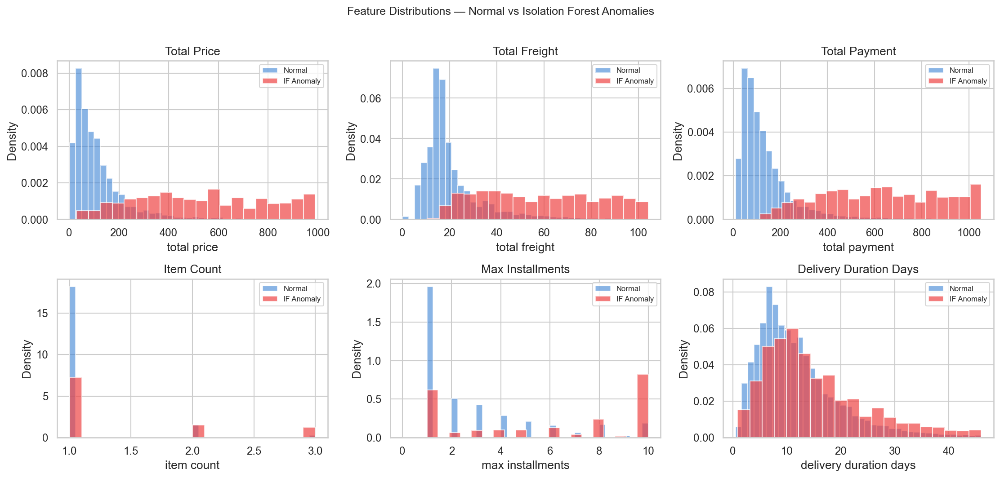

---

## Design Decisions

### Data integrity
- The **original 9 CSV files are never modified**. All transformations write new files to `data/cleaned/`.
- `customer_unique_id` — not `customer_id` — is used as the true unique buyer key in all RFM and segmentation work. `customer_id` is order-scoped and will count the same person multiple times.

### Performance
- `olist_geolocation_dataset.csv` has 1 million rows and must never be loaded in a live API call. The application always uses the pre-aggregated `geolocation_aggregated.csv` (19,015 rows).

### Security
- Database credentials are loaded from `backend/.env` at runtime via `python-dotenv`. No passwords appear in source code.
- The connection URL is built with `SQLAlchemy URL.create()`, which percent-encodes any special characters in the password so they cannot break the URL parser.

### ML methodology
- **Segmentation:** K=4 was selected by silhouette score. Segment names are assigned by descending combined RFM rank to guarantee unique, reproducible labels.
- **Forecasting:** Three models were evaluated (Linear, Polynomial degree 2, Simple Exponential Smoothing). Exponential Smoothing achieved the lowest test MAPE (4.9%), but Polynomial regression is used for the forward forecast because it supports generating future data points from a fitted function.
- **Anomaly detection:** two independent methods (IQR fence and Isolation Forest at 2% contamination) are run separately. Orders flagged by both are highlighted as `both_flag=True`. All flagged records are described as "statistically unusual" — never as fraudulent.

### Power BI
- Power BI is an **offline learning module** only. It connects directly to the MySQL database for practice. It is not a dependency of the web application.

---

## Acknowledgements

- Dataset: [Olist](https://olist.com) — published on Kaggle under a [CC BY-NC-SA 4.0](https://creativecommons.org/licenses/by-nc-sa/4.0/) licence.
- Project built as part of the **AICTE – IBM SkillsBuild Data Analytics with AI Internship 2026 (BharatCares)**.
- Developed with assistance from IBM Bob.
